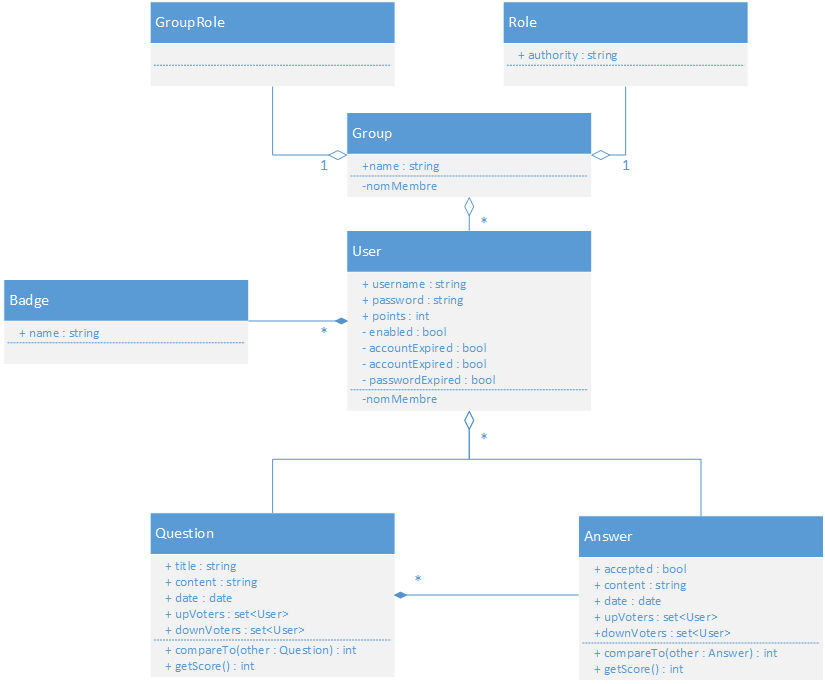
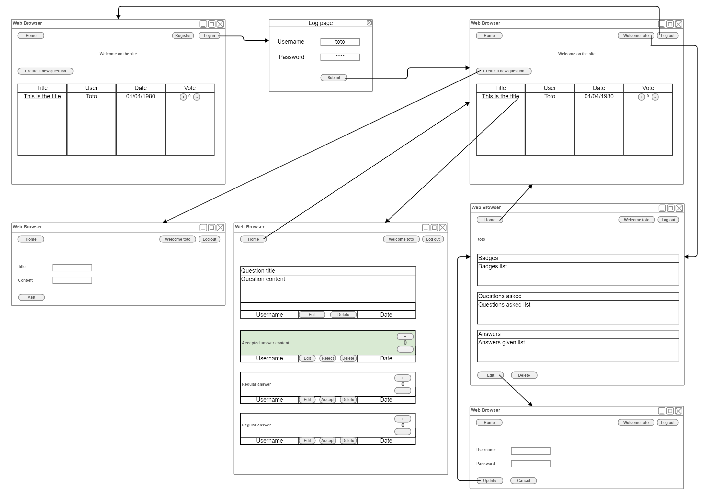

# OverfloZZ app specifications

_Benjamin Barbesange and Pierre-Loup Pissavy_

## Overall

The goal is to create a Grails app to ask and answer questions.
A gamification system will be in place to reward some user actions.

## App conception

The global app conception is defined in the [UML file diagram](Diagramme%20UML%20détaillé.pdf).

## App layout and routing

You can see the main app layout and routing in the [following file](Mockup.png).

Preview

## App specifications

The app does not require user authentication to consult the content.

The app will allow a user to **register** himself on the app.
Once the user is registered succesfully, he will be able to **log in** and **ask** a question, **answer** a question and also **vote** for the different contents (questions and answers).

### Questions

The **questions** are the main entities in the app.
The questions will contain a **title** to quickly identify the topic and a **content** to develop what the user is asking.
When the question is posted, the user will still be able to **edit** the content but not to delete it.

This question will be owned by a **user** and is created at a certain **date**.

On the main page, users will be able to **up vote** or **down vote** questions. This will allow to organize questions according to their interest from the community.

When users are logged, they can **answer** the question by posting.

### Answers

The **answers** are related to a **question,** and is provided by a **user** at a certain **date**.

When an answer is given, only the author is able to **edit** the content.

The question author is able to **accept** the question if he thinks that it answers correctly.

Any logged user can **up vote** or **down vote** a question. This will help organizing the questions by the usefullness of it.

### Users

#### Regular users

The user will be able to view its profile which contains :
* A summary of the **badges** he earned
* A list of **questions** he asked
* A list of **answsers** he gave

He will also be able to edit its **username** or **password**.

#### Administrators

Administrators have special access on different controls for example to **delete** a question, **reject** a previously accepted anwser, **accept** an answer or **edit** a user profile.

